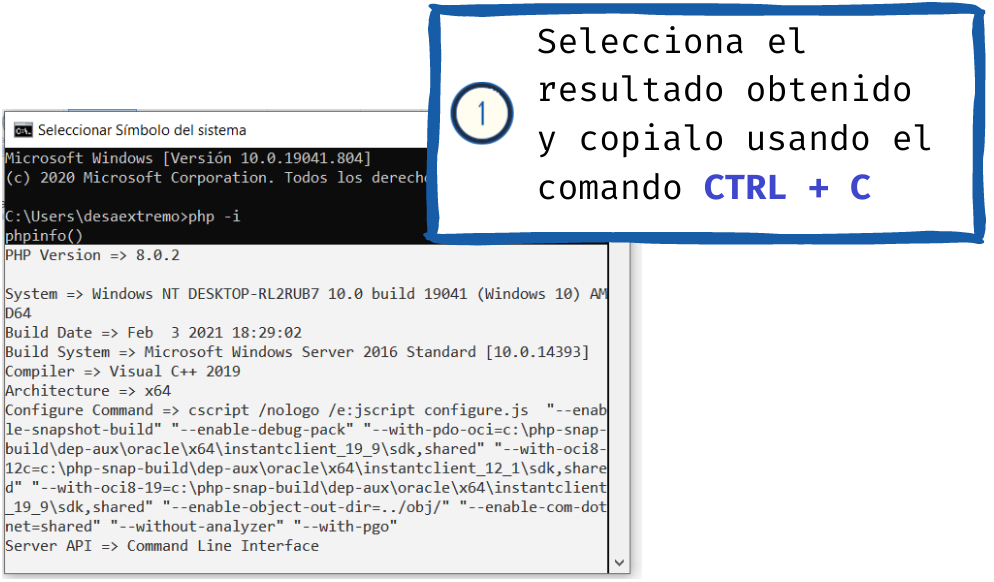

#	Como activar depurador php en Visual Studio Code en Windows?

[1. Modificar el archivo de propiedades de Visual Studio Code para indicar la ruta al ejecutable de PHP](#1-modificar-el-archivo-de-propiedades-de-visual-studio-code-para-indicar-la-ruta-al-ejecutable-de-php)
[2. Agregar PHP al PATH](#2-agregar-php-al-path)
[3. Instalar el plugin PHP DEBUG](#3-instalar-el-plugin-php-debug)
[4. Descargar XDEBUG compatible con el PHP de tu máquina](#4-descargar-xdebug-compatible-con-el-php-de-tu-máquina)
[5.	Configurar la extensión php debug y Visual Studio Code](#5-configurar-la-extensión-php-debug-y-visual-studio-code)
[6.	Utilizar el depurador en Visualstudio Code](#6-utilizar-el-depurador-en-visualstudio-code)

##	1. Modificar el archivo de propiedades de Visual Studio Code para indicar la ruta al ejecutable de PHP
* Abre el archivo settings.json para establecer la ruta del ejecutable de php:

	

	<strong><em>Acceso el archivo settings.json</em></strong>

* Podemos abrir el archivo de configuración <strong><em>settings.json</em></strong> en modo <strong><em>UI</em></strong> tipo interfaz gráfica de administración, o en modo <strong><em>JSON</em></strong>.

 

	<strong><em>archivo settings.json Modo UI</em></strong>u

* Para abrir el archivo de configuración en formato json solo haz clic sobre el icono en forma de hoja que se ubica en la parte superior izquierda de tu pantalla.

 

	<strong><em>archivo settings.json Modo UI</em></strong>

* Modifica el archivo <strong><em>settings.json</em></strong> para asignar un valor a la propiedad <strong><em>"php.validate.executablePath":"Ruta al ejecutable de php"</em></strong>. 

 

	<strong><em>Editando el settings.json</em></strong>

## 2. Agregar PHP al PATH
	
* Para modificar la variable de entorno path solo tienes que hacer lo siguiente:
	

 

	<strong><em>Agregando php a la variable de entorno path</em></strong>

 

	<strong><em>Modificando la variable path</em></strong>

* En una instalación de <strong><em>xampp</em></strong> por defecto <strong><em>php</em></strong> suele ubicarse en: <strong><em>c:\xampp\php</em></strong>)

 

	<strong><em>Agregando la ubicación de la variable path</em></strong>

* Consultar la version de php <strong><em>php -v</em></strong> en la linea de comandos de <strong><em>Windows (cmd)</em></strong>
  

 

	<strong><em>Consultando la versión de php con el comando php -v</em></strong>

## 3. Instalar el plugin PHP DEBUG
* El plugin [php debug](https://marketplace.visualstudio.com/items?itemName=felixfbecker.php-debug) nos permite configurar la opción depurador de Visual Studio Code para el lenguaje <strong><em>php</em></strong>

 

	<strong><em>Versión del plugin y ubicación en el marketplace</em></strong>

 

	<strong><em>Instalando php debug</em></strong>

## 4. Descargar XDEBUG compatible con el PHP de tu máquina
La extensión (librería dll en caso de windows) [xdebug](http://xdebug.org/) se adiciona a la instalación de tu php y junto a php debug permiten la magía de la depuración de código php en tu Visual Studio Code.

Es probable que xdebug ya se encuentre previamente instalado en tu entorno <strong><em>php</em></strong>. Puedes realizar esta comprobación utilizando un script de php que incluya la función [phpinfo()](https://www.php.net/manual/en/function.phpinfo.php). Esta función del lenguaje muestra información sobre la configuración del <strong><em>php</em></strong> instalado en tu maquina.

 

	<strong><em>Script info.php para consultar la configuración de tu php</em></strong>

* Valida la versión de xdebug compatible con tu php

 

	<strong><em>Obteniendo información de tu sistema para instalar xdebug</em></strong>

* Selecciona y copia el resultado obtenido en la  consola, despues de haber ejecutado el comando **_php – i_**

 

	<strong><em>resultado de la ejecución del comando php -i</em></strong>

* Dirigete a la página de [xdebug wizard](https://xdebug.org/wizard)  y pega el resultado para obtener la versión de xdebug acorde a tu máquina

 

	<strong><em>Obteniendo información de la versión de xdbug acorde a tu máquina</em></strong>

* Descarga la versión de [xdebug](https://xdebug.org/download) sugerida

 

	<strong><em>Xdebug sugerido para tu máquina</em></strong>

* Mueve el archivo dll a <directorio instalación php>/php/ext, y modifica el archivo de configuración de php “php.ini”
  

 

	<strong><em>Copiando el la librería y editando el archivo php.ini</em></strong>

El cambio al archivo **_php.ini_** es:
>zend_extension = <ruta al ejecutable php>\<nombre de la librería dll>

**Ejemplo:**
zend_extension = C:\xampp\php\ext\php_xdebug-3.0.3-8.0-vs16-x86_64.dll

Recarga el servidor php y ejecuta el script **_info.php_** para verificar que [xdebug](https://xdebug.org/download) se encuentre habilitado.

 

	<strong><em>Validando la instalación de xdebug</em></strong>

 

	<strong><em>Comprobando la versión de xdebug instalada</em></strong>

* Modifica el archivo “**_php.ini_**” para configurar el xdebug según la versión
instalada en el paso anterior.

	>**_Para Xdebug v3.x.x agregar al php.ini_**:
xdebug.mode = debug
xdebug.start_with_request = yes
xdebug.client_port = 9000

	>**_Para Xdebug v2.x.x agregar al php.ini:_**:
xdebug.remote_enable = 1
xdebug.remote_autostart = 1

 

	<strong><em>archivo php.ini editado</em></strong>

Más adelante describire los pasos que debes seguir para crear el archivo de configuración **_launch.json_**. Este archivo es creado automáticamente por [Visual Studio Code](https://code.visualstudio.com/), y se utiliza para establecer parametros necesario para el depurador, como el puerto sobre el cual estará escuchando peticiones [xdebug](https://xdebug.org/download), y otras caracteristicas adicionales (para un mayor nivel de detalle consultar en la página de [PHP Debug](https://marketplace.visualstudio.com/items?itemName=felixfbecker.php-debug)).

El archivo **_launch.json_** contiene los apartados de configuración **_Listen for XDebug_** que se utiliza para depurar nuestras aplicaciones desde el navegador o browser y **_Launch currently open script_** que se utiliza para depurar en la consola de [Visual Studio Code](https://code.visualstudio.com/).

## 5. Configurar la extensión php debug y Visual Studio Code

A continuación detalleré la secuencia de pasos requeridos para la creación del archivo de configuración en formato json llamado **_launch.json_**.

 

	<strong><em>Accediendo al depurador</em></strong>

 

	<strong><em>Configurando el depurador</em></strong>

 

	<strong><em>Creando el archivo de configuración launch .json</em></strong>

## 6. Utilizar el depurador en Visualstudio Code

* Selecciona el archivo a depurar y establece los puntos de ruptura haciendo clic al costado izquierdo de la línea de codigo.

 

	<strong><em>Estableciendo puntos de ruptura</em></strong>

* Haz clic sobre el icono **_Run and Debug_**

 

	<strong><em>Seleccionando Run and Debug</em></strong>

* Inicia el depurador seleccionando  Listen for [Xdebug](https://xdebug.org/download) en la parte superior del IDE y luego haz clic sobre el icono en forma de flecha.
  

 

	<strong><em>Seleccionando Listen for XDebug</em></strong>

* En este punto el depurador ya se encuentra activado. Inicia tu aplicación, y navega hasta que los puntos de ruptura inicien.

 

	<strong><em>Depurador activado y en espera</em></strong>

* Una vez el depurador se encuentra activo podrás inspeccionar el valor de variables, constantes, variables superglobales y expresiones.

 

	<strong><em>Inspeccionando variables</em></strong>

 

